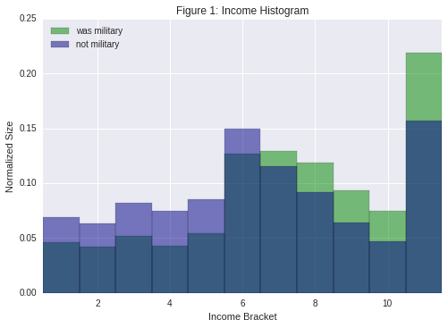
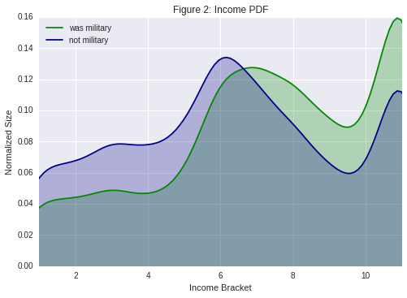

### The Impact of Military Status on Income Bracket

##### Joey Maalouf

After reading through all of the potential variables provided by the National Health Interview Survey [1], I chose to look for a potential link between military status and financial status. More specifically, I wanted to check if whether someone served in the United States military affects their current income bracket.

Roughly 1 in 15 people who responded to the survey were in the military at some point, with 6,863 military responses and 96,926 non-military responses. The respondents' income data was split into 11 different income brackets:

* `01`: $1 - $4,999
* `02`: $5,000 - $9,999
* `03`: $10,000 - $14,999
* `04`: $15,000 - $19,999
* `05`: $20,000 - $24,999
* `06`: $25,000 - $34,999
* `07`: $35,000 - $44,999
* `08`: $45,000 - $54,999
* `09`: $55,000 - $64,999
* `10`: $65,000 - $74,999
* `11`: $75,000 - ∞

Figures 1 and 2 provide a basic visualization of the normalized data, both as a histogram of the actual data (1) and as an estimation of the PDF via KDE (2).

These visualizations make it apparent that people who served in the military were underrepresented in low income brackets and overrepresented in high income brackets compared to the rest of the population. This difference appears more clearly if we split the income data into even broader bracket groupings for further analysis.

##### Table 1
| Military Status | Income < 35k | 35k <= Income |
|:-:|---|---|
| Yes | 36.43% | 63.57% |
| No | 52.49% | 47.51% |

We can observe a significant disparity by splitting at the middle of our income data, cutting the groups into lower and upper brackets. As Table 1 shows, almost two-thirds of the military respondents make at least $35,000 per year; on the other hand, the corresponding ratio is just below half for the non-military respondents.

##### Table 2
| Military Status | Income < 20k | 20k <= Income < 45k | 45k <= Income |
|:-:|---|---|---|
| Yes | 18.29% | 31.11% | 50.60% |
| No | 28.98% | 35.06% | 35.96% |

The imbalance is even more visible if we segment the data into lower, middle, and upper brackets. Among those who were military, over half of the respondents are still in the upper bracket, making over $45,000 per year, with the rest still leaning more towards the middle bracket than the lower one. Non-military respondents, however, remain much more evenly spread across all of the brackets.

Further statistical analysis using the Cohen effect size tells us that the difference in means (standardized by dividing by the standard deviation of the data) is about 0.32, which (according to Cohen himself) is somewhere between "small" and "medium" for an effect size [2]. Using random sampling, we can see that with a standard error of 0.02 and a 90% confidence interval of 0.28 - 0.35, it's pretty clear that this effect size isn't too heavily skewed from any sampling error. Finally, hypothesis testing proves that the difference is all but guaranteed to not be due to random chance, with an extremely significant p-value of 0.0. Of the 10000 shuffled groupings tested, exactly 0 of them even came close to the actual value of 0.32; most stayed in the -0.05 to 0.05 range, hinting that it's near-impossible for a random selection from the entire to cause a difference of this magnitude.

At this point, we have something to consider for any future work: why does this difference exist? Do we have a societal bias to use higher pay to reward those who risk their lives for the rest of us? Or does veterans' experience qualify them for higher-level jobs than the average working adult? Could there be some confounding variable that is responsible for both a higher likelihood of entering the military and a higher income?

[1] [U.S. Department of Health & Human Services (2015). National Health Interview Survey.](https://www.cdc.gov/nchs/nhis/nhis_2015_data_release.htm)
 
[2] Cohen, Jacob (1988). Statistical Power Analysis for the Behavioral Sciences.
 
[Notebook Source](https://github.com/joeylmaalouf/NHIS-analysis/blob/master/report/report2.ipynb)
